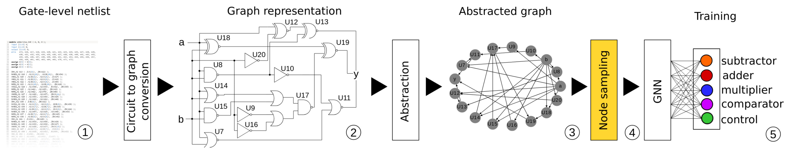

## AppGNN: Approximation-Aware Functional Reverse Engineering using Graph Neural Networks

---

Tim Bücher, Lilas Alrahis, Guilherme Paim, Sergio Bampi, Ozgur Sinanoglu, Hussam Amrouch

---

AppGNN performs node-level classification for functional reverse engineering of flattened gate-level netlists. AppGNN builds on top of [GNN-RE]([GitHub - DfX-NYUAD/GNN-RE: GNN-RE datasets for circuit recognition](https://github.com/DfX-NYUAD/GNN-RE)) in order to reverse engineer approximate circuits.



In the case of using our framework, please use the following citation
```
@inproceedings{appgnn,
  author = {Buecher, Tim and Alrahis, Lilas and Bampi, Sergio and Paim, Guilherme and Sinanoglu, Ozgur and Amrouch, Hussam},
  booktitle = {IEEE/ACM 41st International Conference on Computer-Aided Design (ICCAD'22)},
  month = {11},
  title = {AppGNN: Approximation-Aware Functional Reverse Engineering using Graph Neural Networks},
  year = 2022
}
```


#### Graph sampling

The main contributions of this work lies within the novel graph sampling approach. It generates an approximate variant of an exact implementation in order to *mimic* a generic approximation technique. This functionality is implemented in the following files:

```
graph_leaf_sampling.py
```

and

```
graph_random_sampling.py
```

More information on these approaches can be found in our [Paper](https://arxiv.org/abs/2208.10868) in section 3.4.

#### Requirements

The following dependencies are required to be installed:

```
$ conda create --name myenv python=3.6.8 tensorflow=1.12.0
$ conda activate myenv
$ conda install -c anaconda numpy=1.14.3
$ conda install -c anaconda scipy=1.1.0 
$ conda install -c anaconda scikit-learn=0.19.1
$ conda install -c anaconda pyyaml=3.12
$ conda install -c conda-forge openmp=4.0
$ conda install -c anaconda cython=0.29.2
```

GraphSaint installation (in the root directory, next to ./Netlist_to_graph):

```
$ git clone https://github.com/GraphSAINT/GraphSAINT.git
$ cd GraphSAINT
$ python graphsaint/setup.py build_ext --inplace
```

#### Usage

The following scripts are required to convert gate-level netlists to graphs that can be used in AppGNN:

```
./Netlist_to_graph/Parsers/netlist_to_graph.pl
./Netlist_to_graph/Parsers/theCircuit.pm
./Netlist_to_graph/Parsers/graph_parser.py
./Netlist_to_graph/Parsers/graph_leaf_sampling.py
./Netlist_to_graph/Parsers/graph_random_sampling.py
```

In `./Netlist_to_graph/Circuits_datasets/example` you can find an example training dataset that contains various circuits used for training and validation (originally obtained from [GNN-RE]([GitHub - DfX-NYUAD/GNN-RE: GNN-RE datasets for circuit recognition](https://github.com/DfX-NYUAD/GNN-RE))). In the same directory, you will also find the circuits of exact adder implementations (`*_Xbit_approxlevel_Y.v`) that will be used by AppGNN to generate a *generic* approximated variant of adder circuits. Finally, a true approximate circuit, obtained from the [EvoApproxLib]([EvoApproxLib | Approximate Circuits Library | 8-bit unsigned multiplier](https://ehw.fit.vutbr.cz/evoapproxlib/)) (Test\_\*.v), is located in the same directory. This circuit is used to test the accuracy of AppGNN and can be replaced by any approximate adder circuit. Replace `graph_leaf_sampling.py` with `graph_random_sampling.py` to perform random node sampling instead of leaf node sampling in the following.

To run the example, execute the following:

```
$ cd ./Netlist_to_graph/Graphs_datasets/example
$ perl ../../Parsers/netlist_to_graph.pl -i ../../Circuits_datasets/example
$ cp ../../Parsers/graph_parser.py .
$ cp ../../Parsers/graph_leaf_sampling.py .
$ python graph_leaf_sampling.py
$ python graph_parser.py
$ cd ../../../GraphSAINT
$ python -m graphsaint.tensorflow_version.train --data_prefix ../Netlist_to_graph/Graphs_datasets/example --train_config ../config.yml --gpu -1
```


#### Acknowledgement

We would like thank [Hanqing Zeng]([Hanqing Zeng](https://sites.google.com/a/usc.edu/zengh/home)) for making [GraphSAINT](https://github.com/GraphSAINT/) code available.
